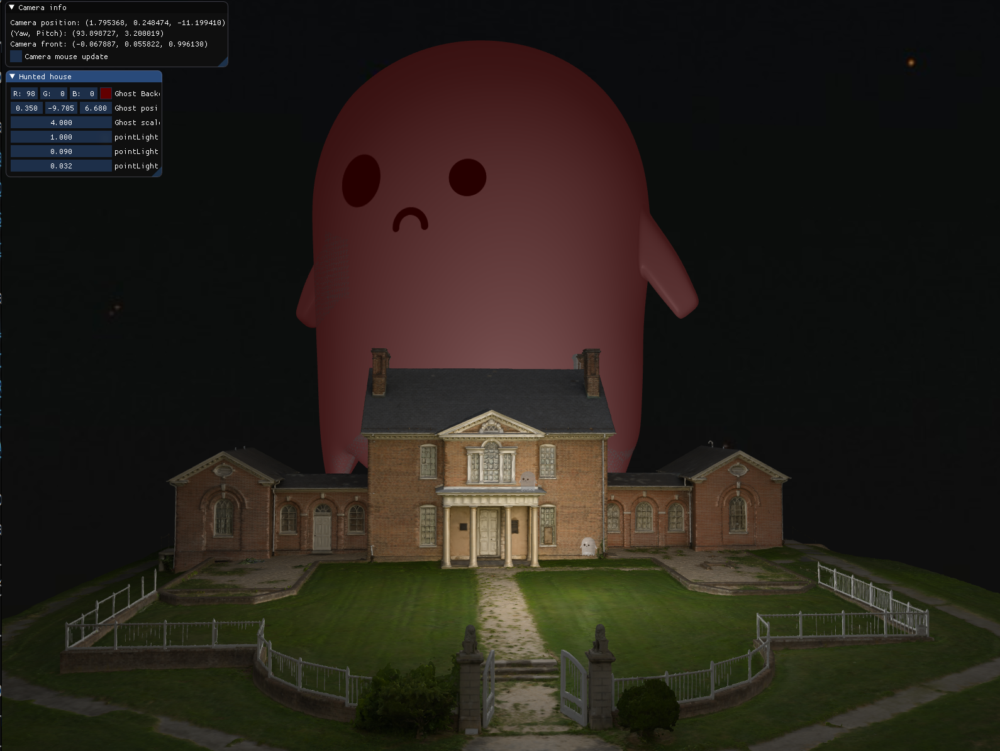

# Projekat iz Racunarske Grafike
Ukleta kuća je okružena duhovima koji svetle, mi možemo da upravljamo jednim od njih.

# Uputstvo
1. `git clone https://github.com/matf-racunarska-grafika/project_base.git`
2. CLion -> Open -> path/to/my/project_base
3. Main se nalazi u src/main.cpp
4. Cpp fajlovi idu u src folder
5. Zaglavlja (h i hpp) fajlovi idu u include
6. Šejderi idu u folder shaders. `Vertex shader` ima ekstenziju `.vs`, `fragment shader` ima ekstenziju `.fs`
7. Preuzeti modele sa sledećeg linka, raspakovati ih u folder `objects`: https://drive.google.com/drive/folders/1a7EefxhQ0f4wRn7brY6P-TurmOwktO4j?usp=share_link
8. ALT+SHIFT+F10 -> project_base -> run
9. `W` `A` `S` `D` - Za kretanje kamere.
10. `F1` - Za pokretanje imgui prozora.
11. Pomoću imgui slajdera možemo pomerati duha, skalirati ga i menjati boju pozadine na njemu.

# Projekat sadrzi
- Oblasti iz prvih 8 časova
- Blending (transparentnost)
- Face culling
- Advanced lighting
- Cubemaps (Skybox)

# Slike

# [Video prezentacija](./slike/video.mkv)
   
